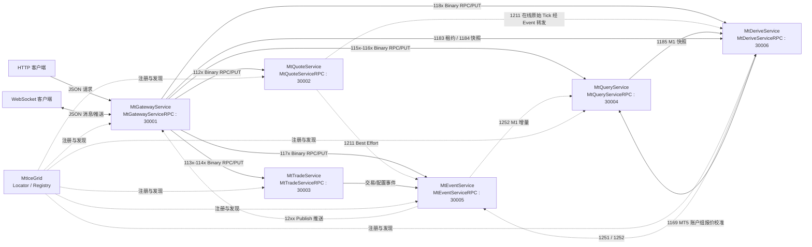

# TradingTerminal V3

## 1. 项目定位

TradingTerminal V3 是基于 Ice 3.8.2 的六服务交易终端框架。工程将外部接入、行情、交易、查询、事件和派生计算拆分为独立进程，通过 MtIceGrid 完成服务注册与发现，通过 CloudNetDataApi 建立服务连接、执行 Binary RPC/PUT、维护重连和推送订阅。

本 README 是项目架构与代码导航入口。具体构建、部署和启动命令以[服务启动操作手册](服务启动操作手册.md)为准。

截至 2026-08-06，项目状态为 **Quote/Event 候选源码已收敛、六服务不可真实联调、不可生产平替**。文中“已实现”只描述候选源码能力；生产结论必须以[第一阶段平替 V2 收尾计划](第一阶段平替V2收尾计划.md)的“源码完成、单测通过、真实联调通过、生产验收通过”四类证据为准。本轮把 Quote 收敛为单实例、每个 Version+No 单连接的原始 Tick 接入服务，并把 Event 收敛为单实例在线中继和单副本 JetStream；Derive、Query 和 Gateway 的完整消费者改造及真实联调仍待完成。

### 1.1 当前实现边界

当前已经完成以下第一阶段框架能力：

- 六个独立 EXE 工程及其独立 XML 配置。
- IceGrid Node 通过 `activation="always"` 常驻托管六服务，Registry/Node Windows 服务配置自动恢复，业务进程异常退出时由 Node 重新拉起。
- 六服务公共 Breakpad 在业务组件启动前安装，dump 写入 `bin\x64vc14\dump\<ServiceName>`。
- 六个 EXE 分别维护 `VERSIONINFO`，公共组件支持 `--version` 和 `1102` 真实版本查询。
- 启动成功输出服务名、版本和配置；启动失败输出阶段、返回码和详细英文错误。
- MtIceGrid 服务注册、发现和 CloudNetDataApi 连接维护框架。
- MtGatewayService 已登记 V2 的 30 个 HTTP URL，并通过独立兼容校验器实现根节点、允许字段、Token/Login、`Version/No`、分页、`OptType` 等本地规则，以及原生 Binary 编解码、异步路由、超时和单次应答；真实 V2 黄金差分尚未通过。
- MtGatewayService 已实现 WebSocket `10001-10003`、八类 Topic、Quote/Profit/Kline 快照增量屏障、共享不可变 JSON 正文、固定 Sender 批量扇出和慢连接明确关闭；同一连接始终由固定 Sender 按统一入队顺序处理。
- MtGatewayService 已实现实例级后端池和 `1103` 集群状态监控；状态型请求只路由到当前 `Version+No` Owner，幂等查询最多切换一次，交易禁止自动重试。
- 公共 NATS JetStream KV 协调器代码继续编译；第一阶段 Quote 的 dev/test 均缺少生效 Cluster 节点，固定以 DISABLED 单实例方式运行且不连接 NATS KV。Quote 多实例 Owner 竞争属于第二阶段。
- MtTradeService、MtDeriveService 仍保留现有 Owner/fencing 候选实现；MtQuoteService 第一阶段禁用 Owner 竞争和行情主备，仅做原连接断线重连。
- MtEventService 保留 Core NATS 广播代码供第二阶段使用；第一阶段固定单实例、本地 Ice 扇出和单节点单副本 JetStream。Quote 不使用 `MT_DERIVE_TICKS` 或 NATS KV，Event 行情也不进入 NATS。
- IceGrid 应用描述已按环境隔离：dev 模板只登记 Node1 上的6个 Server/Adapter，test 模板登记两个 Node 上的12个唯一 Server/Adapter；两者共享六个 Replica Group。实例配置生成脚本会同步唯一 AdapterId、pluginId、数据目录和同 Node Event 代理。
- `12xx` 通知协议、ClientData Binary 正文、发布订阅和 Web 推送转换框架。
- MtQuoteService 已为每个 `Version+No` 建立独立 SourceEpoch、连续序号、进程内 FIFO 和唯一 `QUOTE_PUMPING` 连接；热路径固定为“最小校验和深拷贝 -> 排队 -> Quote Tick Binary v1 -> `1211`”。`queueCapacity=0` 不因容量淘汰，正数满载淘汰最旧 Tick。
- 六服务公共入口从启用的 `<Subscriptions>` 生成 12xx 白名单，非白名单通知在正文解码前限频拒绝；IceRPCPush 的新注册接口严格解析 `subInfo`，非法文本不再退化为 `0=全订阅`。
- MtQuoteService 已删除服务器时间偏移、UTC 转换、`TIME_QUERY`、`1123/1244`、OpenPrice 和 TickStat 业务处理。Quote Tick Binary v1 只保留原始服务器时间、接收时间和原始价格/成交量，不再编码时间权威、业务扩展或 Owner/Fencing。
- MtDeriveService 已删除 `1181` Demo，正式处理 `1182-1186`；当前完成无损 Tick、权威 M1、`1252`、收益租约、真实收益计算和 `1251` 工作线程，以及 `1173/1174 + 1167` 的可靠状态消费、进度、DLQ 和快照增量恢复框架。MT5 Profit 已接入 V2 同名 `CMt5ProfitGroupQuoteService`：实时 Tick 样本与 Query `1169` 的同租约双 `TickLast` 结果共同校准账户组有效报价，校准不可用时保留 `1167` 的 `PriceCurrent/Profit`。真实节点未就绪或权威实体未恢复完整时，`1184` 仍按来源返回 `BOOTSTRAPPING`。
- MtEventService 已增加 Quote v1 三层一致性校验、固定来源分片、重复/乱序拒绝、Epoch/缺口诊断、`1251/1252` 来源校验、本地 Ice 中继和 `1176` 定向心跳；第一阶段 Cluster/Broadcast 均禁用。
- MtQueryService 当前仍包含旧 `1122/1123` 消费路径；按照本轮配套方案，后续要把行情初始快照改为 Derive Owner，并由 Query 自己持有时间权威。该消费者改造未在本轮落地，是六服务联调阻断项。
- MtQueryService 将 `1244` 实际切换记录按 `Version+No` 原子保存到时间日志；历史账户、订单、持仓、成交和 K线优先使用实际切换记录，日志覆盖前才回退 Windows 动态时区规则。
- MtQueryService 在发布进程 `READY` 前执行有界 `1123` 时间引导；dev 超时后按配置降级，test 超时启动失败，消除健康环境首笔 `/bars` 因启动时序返回 `20008` 的窗口。
- MtQueryService 的 `1153 /symbols` 与 `1159 /accounts/symbols` 已接入 V2 同名 `ServerTimeUtcUtil`、`SymbolSessionUtcUtil`：MT4 从固定七日三槽位、MT5 从 SDK 动态 Session 枚举生成 UTC0 `Session.Trade/Quote`，`TimeStart/TimeExpiration` 继续按目标日期实际 `1244` 记录或 Windows 动态时区转换；真实 Broker Session 与 DST 差分仍待验收。
- MtGatewayService 已把 Profit 订阅聚合为 `1183` 绝对租约，并从 `1184` 获取初始收益快照；租约同步不阻塞 Web I/O 回调。
- MtQueryService 已迁移 WatchList/Chart PostgreSQL 连接池与 Repository，Binary 只在数据库边界转换为内存 JSONB 值；运行时只校验表结构，不自动执行 DDL。历史保存使用任务、Bar 数和字节三重上限，同键任务合并，文件并发控制固定为 256 个哈希锁分片。
- 六服务公共日志队列使用 65536 条、64 MiB 双上限；高频拒绝通知按分钟汇总。内部 `1103 v2` 返回进程 Private Bytes/Working Set、线程/句柄、日志队列与丢弃、通知计数及 Quote/Trade/Query 私有边界指标，v1 消费端仍可解码公共前缀。
- ClientData 第一批同名契约已对齐 V2：连接池和四组 Repository 的返回码字段、`CConnectionGuard::GetCode` 及关联辅助函数统一使用 `int`；协议测试以成员函数指针和字段类型静态断言防止再次窄化。旧 V2 HTTP Handler 同名门面仍待迁移，Gateway 当前继续使用现有 `1165/1166` 校验和异步路由链。
- 六服务共享的应用框架、错误码、V2 日志组件、线程组件和版本化 Binary 协议；错误码使用编译期只读有序数组和二分查找，每个枚举值及兼容别名都在声明处提供简体中文触发条件，Gateway 对 30 个兼容 URL 及 Web 控制应答统一输出 V2 原 `Code` 和固定英文 `Msg`，内部详细诊断不对外暴露。

以下内容尚未通过生产平替验收：

- 真实 MT4/MT5 行情、交易、Pumping/Dealer 回调、普通查询和历史查询的完整联调及 V2 差分。
- PostgreSQL 表结构、事务、并发更新及 ClientData 全接口验证。
- JetStream ACK、重投、DLQ、积压、容量和服务重启恢复验证。
- 基于真实权威账户、持仓、品种、组和汇率状态的 Profit 差分及 `1251` 时效验证。
- 30 个 HTTP、八类 Web Topic、真实 Broker 冬夏令规则及跨点、故障注入、正式压力和 72 小时稳定性验收；本地 Windows 动态时区和 Pacific DST 单测通过不能替代该项。
- IceGrid 托管、Breakpad dump 和 Windows 服务恢复的故障演练，以及 30 秒恢复门槛的外部验收。
- 第二阶段高可用验收：三节点 NATS quorum 丢失、状态型 Owner 20 秒接管、Registry Master 故障、双 Nginx/L4 VIP 摘流、10 万 WebSocket N+1 和 72 小时稳定性。
- MtTradeService 的幂等库和 outbox 当前仍是节点本地文件，只覆盖同机进程重启；整机磁盘丢失恢复依赖第二阶段 PostgreSQL transactional outbox，现阶段不得据此宣称交易全量跨机 RPO=0。

第一阶段配置迁移已经完成：`dev/test` XML 直接保存从 V2 对应环境逐节点迁移的 MT 与 PostgreSQL 地址、账号和明文密码，不再读取 MT/PG 凭据环境变量。MtQuoteService、MtTradeService 和 MtQueryService 已统一使用 `<Connections>` 角色模型，旧连接计数字段和旧凭据字段不再兼容读取。部署脚本将选中的环境模板复制为 EXE 同级 `<ServiceName>.xml`，程序始终只读取该无后缀配置。明文配置必须限制文件访问权限，密码不得进入日志、错误、状态接口或文档示例。

## 2. 六服务架构

| 服务 | Ice 对象 | 端口 | 目标职责 | 主动连接 | 推送订阅 | 当前实现 |
| --- | --- | ---: | --- | --- | --- | --- |
| MtGatewayService | `MtGatewayServiceRPC` | `30001` | 提供 HTTP/WebSocket 入口；完成认证、校验、JSON/Binary 转换、后端选择、超时治理和前端推送，不处理业务 | Quote、Trade、Query、Event、Derive | MtEventService | 双活；30 个 HTTP、Web `10001-10003`、实例级 `1103` 监控和 Owner-aware 路由已实现 |
| MtQuoteService | `MtQuoteServiceRPC` | `30002` | 单实例接收 MT4/MT5 原始 Tick，分配 SourceEpoch/Sequence 并发布 `1211` | 无 | 无 | 每个 `Version+No` 一条物理连接；原连接重连、进程内 FIFO、Quote Tick Binary v1 和 `1124` 已落地；无 WAL/快照/校时 |
| MtTradeService | `MtTradeServiceRPC` | `30003` | 处理下单、撤单、改单；接收订单、成交、持仓、保证金和配置变化；向事件中心提交交易及配置事件 | MtEventService | 无 | 按 `Version+No` 单主热备；`1132-1142`、五类角色池、Dealer 对账、fencing、节点本地幂等/outbox 已实现 |
| MtQueryService | `MtQueryServiceRPC` | `30004` | 提供普通查询、历史查询、实时行情快照、K线、MT5 账户组报价校准和 PostgreSQL ClientData | MtQuoteService、MtEventService、MtDeriveService | MtEventService | 双活；`1152-1169`、普通/历史池、PostgreSQL Repository 和 Owner-aware 快照路由已实现；`1169` 仅允许 Derive 内部调用 |
| MtEventService | `MtEventServiceRPC` | `30005` | 单实例校验并中继行情/派生通知；独立提供可靠事件 JetStream | MtQuoteService、MtDeriveService | MtQuoteService、MtDeriveService | 第一阶段本地 Ice 扇出；`1211/1251/1252`、`1172-1176` 已实现，Cluster/Core NATS 广播禁用 |
| MtDeriveService | `MtDeriveServiceRPC` | `30006` | 接收无损 Tick、生成权威 M1、维护收益需求租约和派生状态；恢复权威账户状态并计算收益 | Query、Event | 无 | 按 `Version+No` 单主热备；`1182-1186`、可靠恢复、Profit/M1、fencing 和 durable 分片接管已实现 |

其中 Quote、Trade、Query、Event、Derive 是表格中的服务简称，XML 中连接名使用完整的 `MtQuoteService`、`MtTradeService`、`MtQueryService`、`MtEventService`、`MtDeriveService`。

## 3. 协作拓扑



实线表示主动请求方向，虚线表示服务发现或主动推送方向。Quote 新边界已经落地，但图中的 Derive 1211 消费和旧 1122/1123/1182 下线仍待其他插件后续实施；当前图表示目标协作方向，不代表端到端联调通过。

## 4. 基础依赖分层

### 4.1 MtIceGrid

MtIceGrid 提供 Registry、Locator 和 Node 基础能力。六个服务启动后，将各自对象适配器注册到 Locator；调用方通过对象标识发现目标服务，不在业务代码中固定目标进程地址。

MtIceGrid 负责 Registry/Locator、应用部署、Node 常驻托管和副本组登记。`MtApplication_dev.xml` 和 `MtApplication_test.xml` 中的 Server 使用 `activation="always"`；Node 启动或应用部署后自动拉起服务，异常退出后重新激活。`deploy_app.bat` 和 `admin.bat` 必须显式传入 `dev|test`，防止单机 Registry 误装载双节点描述。受控升级使用 IceGrid Admin 的 `server stop/start`，`start_all.bat` 和逐 EXE 启动仅用于前台诊断，不能与托管实例并存。

### 4.2 CloudNetDataApi

六个服务只直接使用 CloudNetDataApi 的公共 C API。该层负责：

- 读取每个服务的 XML 网络配置。
- 启动本地 Binary 服务。
- 建立并维护 XML 中声明的远端连接。
- 提供同步/异步 Binary RPC 和 PUT。
- 定时重连断开的服务。
- 注册推送、定时续约和发布通知。
- 隔离 IceRPCPush 的句柄、回调桥和实现细节。

业务服务不得直接包含 IceRPCPush 内部头文件或实现源码。

### 4.3 IceRPCPush

IceRPCPush 是 CloudNetDataApi 下层的 Ice 3.8.2 通信封装，负责代理、适配器、同步/异步 Ice 调用、Binary 载荷、Snappy 压缩和底层异常转换。六个业务工程通过 CloudNetDataApi 间接使用它。

## 5. 主要协作链路

### 5.1 HTTP 查询

1. HTTP 客户端向 MtGatewayService 提交 JSON 请求。
2. MtGatewayService 根据 URL 映射得到 `115x-116x` 内部功能号和 `MtQueryService` 连接名。
3. MtGatewayService 将请求编码为版本化 Binary 载荷，通过 `CallBinaryAsync` 异步调用 MtQueryService。
4. MtQueryService 执行普通查询或历史查询并返回 Binary 结果。
5. MtGatewayService 将结果转换为统一 JSON 应答。

网关和 Query 已使用正式 `1152-1166` 功能号及 Query Binary 契约。`1156` 读取 `1211` 建立的最新行情快照，`1157` 返回 Derive `1185/1252` 建立的权威 M1，`1165/1166` 访问 PostgreSQL；`1153-1155`、`1158-1164` 已进入按 `Version+No` 隔离的正式 MT4/MT5 普通/历史 Adapter。真实节点凭据缺失、连接池未就绪或数据源降级时返回详细英文错误，不使用 Mock 数据伪造生产结果。

### 5.2 交易请求与交易事件

1. MtGatewayService 将下单、撤单或改单请求映射到 `113x-114x`，异步调用 MtTradeService。
2. MtTradeService 执行交易命令并返回受理或执行结果。
3. 订单、成交、持仓、保证金和交易源状态变化由 MtTradeService 提交给 MtEventService。
4. MtEventService 使用 `122x` 通知号推送给 MtGatewayService 等订阅者。
5. MtGatewayService 将内部通知转换为前端 Web 协议后分发。

网关使用正式 `1132-1142` 功能号和 Trade Binary 契约。MtTradeService 已实现 MT4/MT5 SDK Adapter、多 `Version+No` 路由、ClientRequestId 持久化幂等和 durable outbox；写请求不会由网关自动重试。MT5 Dealer 命令被 SDK 接受时只返回 `submitted` 和 `RequestId`，最终成交状态仍应通过可靠事件或权威查询确认。

当前真实 MT4/MT5 柜台尚未完成联调。每个节点已按 `TRADE_COMMAND`、`TRADE_PRECHECK`、`STATE_PUMPING`、`CONFIG_PUMPING` 和 `PUMPING_QUERY` 建立独立角色；`count` 会创建同等数量、互不借用的 SDK Adapter，Pumping 连接由后台线程独占。`1133` 已完成账户、权限、品种和 Tick 等基础预检，MT4 Pumping、MT5 Dealer 回调、RequestId 最终状态、超时待确认和重启对账代码已经落地；保证金、交易时段及 Stops Level 的平台差异仍需结合真实服务器验收。

### 5.3 行情接收与发布

1. MtQuoteService 按 `Version+No` 隔离唯一 MT4/MT5 Manager API、回调、SourceEpoch、连续序号和进程内队列。
2. SDK 回调只做最小校验和深拷贝，不发布网络、不写文件、不计算业务。
3. Manager 在来源 FIFO 中分配 SourceEpoch 和 Sequence，单工作线程编码 Quote Tick Binary v1。
4. Quote Binary 包装为 ClientData Binary，通过 `1211` 进入 Event 的 Best Effort 在线队列。
5. 原连接断线恢复时旋转 Epoch；消费者后续根据 `1124`、Epoch 和序号缺口安排历史补数。

`queueCapacity=0` 表示运行期间不因容量主动淘汰；正数模式满载淘汰最旧 Tick。Quote 无 WAL，不恢复进程停止期间 Tick，也不提供 `1122/1123/1182`。

### 5.4 派生计算与重启恢复

1. MtDeriveService 后续从 MtEventService 消费 Quote 发布的 `1211`，按 `Version+No+SourceEpoch+Sequence` 识别连续区间和缺口；Quote 不调用 `1182`，也不等待派生 ACK。
2. MtDeriveService 使用真实 Tick 生成 OHLC/Volume；发现 Epoch 旋转、序号缺口、Quote 重启或重连时，由 Derive 自行通过 Query 历史接口补齐当天分钟，无 Tick 分钟不生成假 K。
3. Derive 发布 `1252`，MtEventService 校验来源与正文后中继；MtQueryService 通过 `1185+1252` 维护 `/bars`，MtGatewayService 通过同一屏障推送 Web Kline=`128`。
4. MtGatewayService 将所有 Profit Web 订阅聚合为 `1183` 绝对集合租约，并用 `1184` 获取初始快照。
5. Profit 使用 `Symbol -> affected Login` 反向索引和分片脏队列；`profitMinIntervalMs=0` 立即计算，队列溢出进入 DEGRADED 并执行分片全量补偿。
6. Derive 先消费并缓冲 `1173` 可靠增量，再逐来源拉取 Query `1167` 分页快照，安装 `EventSequence` 水位后只应用其后的事件；处理成功后使用 `1174` ACK 并原子保存本地进度。
7. MT5 Profit Worker 以 `No+Group+Symbol+Login` 登记依赖；Derive 的校准线程调用 Query `1169`，只接受同一普通池租约内取得、毫秒一致且命中实时 Tick 样本的全局/组报价，并以两个不同 Tick 的一致候选确认偏移。
8. 用户、持仓、组、品种可靠事件以及 Owner、时间代次变化会幂等失效对应需求和值；校准未就绪、失败、停用或过期时继续使用 `1167` 持仓的 `PriceCurrent/Profit`，不得用节点原始报价伪造组报价。
9. Query 的账户、持仓、品种和组权威 Adapter 及 `1167` 分页链路已经落地；当真实节点未连接、权威实体不完整或时间状态未就绪时，`1167` 明确返回数据源状态，`1184` 继续返回 `DERIVE_STATE_BOOTSTRAPPING`，不会伪造零收益，`1251` 也不会提前发布。

当前已完成无损 M1、收益租约以及可靠状态恢复框架。`dev` 配置关闭可靠消费，`test` 配置启用；命令请求不能作为权威状态事件，在真实 Pumping/Dealer 回调尚未到达时 Trade 明确返回 `AWAITING_AUTHORITATIVE_CALLBACK`。

### 5.5 服务晚启动和重启恢复

1. 每个服务从同目录的 `<ServiceName>.xml` 读取 `Local`、`Services` 和 `Subscriptions`。
2. CloudNetDataApi 通过 MtIceGrid Locator 发现 XML 中声明的目标服务。
3. 目标服务尚未启动或重启时，CloudNetDataApi 后台线程按配置继续重连。
4. 连接恢复后，推送订阅按续约周期重新注册。
5. MtGatewayService 使用 `1103` 拉取实例、角色、分片和租约代次，清除探测失败实例的陈旧租约；状态型请求只转发给对应 `Version+No` 的 `READY Owner`。

动态恢复范围限于 XML 已声明的服务。运行时新增未知服务时，必须先更新 XML，再执行配置重载流程或重启相关进程。

## 6. 协议边界

| 协议范围 | 使用位置 | 约束 |
| --- | --- | --- |
| Web `10001-10004` | MtGatewayService 与 WebSocket 客户端之间 | 只允许 MtGatewayService 定义和解析，不得进入插件间 Binary 调用 |
| 内部调用 `11xx` | 六服务之间的 Binary RPC/PUT | 功能号表示目标操作；同步和异步共用同一功能号 |
| 内部通知 `12xx` | MtEventService 发布及订阅者接收 | 通过 `Publish` 的 `ReqNo` 传递，不得作为 RPC `FuncId` |

当前功能号迁移状态如下。六服务 Demo 活动实现均已删除，已发布编号只保留废弃登记，禁止重新分配：

| 功能号 | 服务 | 用途 |
| ---: | --- | --- |
| `1101` | 全部服务 | 健康检查 |
| `1102` | 全部服务 | 程序及协议版本查询 |
| `1103` | 全部服务 | 集群实例、分片 Owner、租约代次和恢复状态查询，不返回凭据 |
| `1111` | MtGatewayService | 已废弃；网关 Demo 路由和处理代码已删除 |
| `1131` | MtTradeService | 已废弃；正式交易处理器已经替换 Demo |
| `1132-1142` | MtTradeService | V2 交易接口的正式 Binary 功能号，已进入 MT4/MT5 Adapter |
| `1152-1166` | MtQueryService | V2 查询、WatchList 和 Chart 的正式 Binary 功能号 |
| `1167` | MtQueryService | Derive 冷启动使用的账户、持仓、品种、组和汇率分页快照 |
| `1168` | MtQueryService | Derive 使用历史池执行 M1 缺口回填 |
| `1169` | MtQueryService | Derive 使用普通池零等待租约读取 MT5 全局与账户组报价；内部接口，不暴露 HTTP |
| `1121/1171` | MtQuoteService、MtEventService | 已废弃；正式 `1211` 行情链路已经替换 Demo |
| `1172-1175` | MtEventService | JetStream 可靠事件追加、拉取、ACK 和状态查询 |
| `1151` | MtQueryService | 已废弃；正式 `1152-1166` 分发已替换 Demo |
| `1181` | MtDeriveService | 已废弃；Demo 处理器已删除，编号禁止重新分配 |
| `1182` | MtDeriveService | 现有 Derive Tick 批量兼容入口；第一阶段 Quote 不调用，后续消费者迁移完成后评估保留或退休 |
| `1183` | MtDeriveService | Gateway 替换、续约或删除收益需求绝对租约 |
| `1184` | MtDeriveService | 查询收益初始快照；权威状态未恢复时返回 `BOOTSTRAPPING` |
| `1185` | MtDeriveService | Query 拉取权威 M1 全量快照或指定范围 |
| `1186` | MtDeriveService | 查询来源 Epoch/ACK/WAL、租约数量和派生状态 |
| `1191` | 全部服务 | Binary Echo 诊断 |

协议数值的唯一代码来源是 `common\protocol\TradingTerminalProtocol.h`。业务源码不得散落协议魔法数字，也不得在服务私有头文件中重复定义内部协议。

## 7. 仓库结构

```text
mt5-terminal-v3\
├─ build.bat                     # 构建并按 dev/test 选择配置打包
├─ deploy_config.bat             # 将环境模板部署为六份同名运行配置
├─ start_all.bat                 # 前台诊断：部署指定环境配置并启动六服务，不用于正式托管
├─ project\vs2022\
│  ├─ TradingTerminal.sln
│  ├─ TradingTerminal.Common.props
│  ├─ AGENTS.md
│  ├─ MtGatewayService\
│  ├─ MtQuoteService\
│  ├─ MtTradeService\
│  ├─ MtQueryService\
│  ├─ MtEventService\
│  └─ MtDeriveService\
├─ services\
│  ├─ MtGatewayService\include|source\
│  ├─ MtQuoteService\include|source\
│  ├─ MtTradeService\include|source\
│  ├─ MtQueryService\include|source\
│  ├─ MtEventService\include|source\
│  └─ MtDeriveService\include|source\
├─ common\
│  ├─ ServiceApplication.*
│  ├─ ClusterCoordinator.*
│  ├─ CrashHandler.*
│  ├─ ProgramVersion.*
│  ├─ CodeMsg.*
│  ├─ Log.*
│  ├─ LogConfig.*
│  ├─ Thread.*
│  ├─ v2compat\market\
│  │  ├─ ServerTimeUtcUtil.*
│  │  └─ SymbolSessionUtcUtil.*
│  └─ protocol\
│     ├─ TradingTerminalProtocol.*
│     ├─ ClusterBinaryProtocol.*
│     ├─ PluginBinaryProtocol.*
│     ├─ QueryBinaryProtocol.*
│     ├─ TradeBinaryProtocol.*
│     ├─ ReliableEventBinaryProtocol.*
│     ├─ ClientDataBinaryProtocol.*
│     ├─ QuoteBinaryProtocol.*
│     ├─ QuoteSnapshotBinaryProtocol.*
│     └─ DeriveBinaryProtocol.*
├─ conf\
│  ├─ MtGatewayService_dev.xml
│  ├─ MtGatewayService_test.xml
│  ├─ MtQuoteService_dev.xml
│  ├─ MtQuoteService_test.xml
│  ├─ MtTradeService_dev.xml
│  ├─ MtTradeService_test.xml
│  ├─ MtQueryService_dev.xml
│  ├─ MtQueryService_test.xml
│  ├─ MtEventService_dev.xml
│  ├─ MtEventService_test.xml
│  ├─ MtDeriveService_dev.xml
│  └─ MtDeriveService_test.xml
├─ vender\
│  ├─ CloudNetDataApi\
│  ├─ SocketServer\
│  ├─ tinyxml\
│  ├─ nlohmann\
│  ├─ pqxx\
│  ├─ nats\
│  ├─ breakpad\
│  ├─ nsdk\
│  └─ thread\
├─ bin\x64vc14\
├─ build\
├─ docs\
├─ tests\
│  ├─ MtGatewayServiceProtocolTests\
│  ├─ V2V3DifferentialTest\       # 30 HTTP URL 的 V2/V3 双端严格差分工具
│  └─ reports\first-phase\        # 第一阶段证据模板及按时间隔离的脱敏执行报告
└─ tools\
   ├─ README.md                  # 工具总入口
   ├─ configure_instance.vbs    # 为每个 Node 生成唯一实例、Adapter 和本地 Event 代理
   ├─ MtGatewayServiceLoadTest\ # 正式健康接口和 WebSocket 心跳压测工具
   ├─ MtDeriveDlqTool\          # 查看、导出、按 EventId 提交安全重放及审计的独立工具
   ├─ NATS\                     # NATS 2.11.6；第一阶段单节点生效，第二阶段三节点配置保留
   ├─ Nginx\                    # Nginx 1.30.4 双入口配置、许可证和 WinSW 服务定义
   ├─ WinSW\                    # WinSW 2.12.0 固定版本、校验信息和许可证
   └─ IceGrid\                  # IceGrid 3.8.2 双 Registry、双 Node 和应用描述
      ├─ app\MtApplication_dev.xml
      ├─ app\MtApplication_test.xml
      ├─ bin\                    # Registry、Node、Admin 和运行库
      ├─ config\                 # Registry、Node、Admin 基础配置
      ├─ tool\                   # 运维脚本及脚本 README
      └─ 部署步骤.md
```

`vender` 中还保存其他后续业务可能使用的依赖，但只有工程文件实际引用的库才属于当前六服务的直接编译依赖。

`tools\IceGrid` 是可独立复制到客户机的 IceGrid 3.8.2 部署根目录。首次安装、同节点重新部署、远程 Node 接入、多实例和负载均衡操作以 `tools\IceGrid\部署步骤.md` 为准；`db`、`log` 和 `config\service` 是安装或运行时生成的机器状态，不随源码包预置数据。

## 8. 公共代码

六个项目共同编译根目录下同一份公共源码，不在各服务目录复制：

| 文件 | 职责 |
| --- | --- |
| `common\ServiceApplication.h/.cpp` | 六服务启动、配置读取、CloudNetDataApi 生命周期、公共健康检查和 Binary 回调框架 |
| `common\ClusterCoordinator.h/.cpp` | 读取公共 Cluster 配置，维护 NATS KV 实例心跳和分片 CAS 租约，执行续约、释放及 quorum 丢失 fail closed |
| `common\CrashHandler.h/.cpp` | 六服务共享 Breakpad 处理器，按 `dump\<ServiceName>` 隔离 minidump 和崩溃标记 |
| `common\ProgramVersion.h/.cpp` | 使用 Win32 Version API 读取当前 EXE 的四段 `VERSIONINFO` |
| `common\CodeMsg.h/.cpp` | 统一错误码和详细英文错误描述 |
| `common\Log.h/.cpp` | 直接复用 V2 的基础日志、HTTP 日志和 Web 日志实现 |
| `common\LogConfig.h/.cpp` | 读取服务日志路径、名称和级别 |
| `common\Thread.h/.cpp` | V2 日志组件使用的公共线程封装 |
| `common\v2compat\market\ServerTimeUtcUtil.h/.cpp` | 完整保留 V2 四个服务器时间转换签名；Query 在目标日期 DST 解析后委托其完成最终安全算术和溢出复核 |
| `common\v2compat\market\SymbolSessionUtcUtil.h/.cpp` | 完整保留 V2 两个结构和四个函数签名；Query 1153/1159 复用其偏移、跨日和跨周 Session 转换语义 |
| `common\protocol\TradingTerminalProtocol.h/.cpp` | `11xx/12xx` 协议、插件标识、通知元数据和已退役编号登记 |
| `common\protocol\ClusterBinaryProtocol.h/.cpp` | `1103` 集群状态和 fencing 数据的固定小端显式编解码与严格长度校验 |
| `common\protocol\PluginBinaryProtocol.h/.cpp` | 固定小端、版本化、带领域隔离的通用 Binary 字段树 |
| `common\protocol\QueryBinaryProtocol.h/.cpp` | MtQueryService 请求和应答的 Binary 文档包装 |
| `common\protocol\TradeBinaryProtocol.h/.cpp` | MtTradeService 请求和应答的 Binary 文档包装 |
| `common\protocol\ReliableEventBinaryProtocol.h/.cpp` | MtEventService `1172-1175` 可靠事件请求和应答的独立 Binary 领域包装 |
| `common\protocol\ClientDataBinaryProtocol.h/.cpp` | MtEventService 到网关的 Web 客户端数据事件正文 |
| `common\protocol\QuoteBinaryProtocol.h/.cpp` | `1211` Quote Tick Binary v1 唯一布局；旧开发态 v3-v6 正文一律拒绝 |
| `common\protocol\EventHeartbeatBinaryProtocol.h/.cpp` | `1176` Event 定向心跳、队列计数、逐来源水位和 JetStream Ready |
| `common\protocol\QuoteHeartbeatBinaryProtocol.h/.cpp` | `1124` 定向心跳请求和 Quote 来源连接、Epoch、Sequence、队列及故障计数响应 |
| `common\protocol\QuoteSnapshotBinaryProtocol.h/.cpp` | 历史 `1122` 行情快照兼容契约；Quote 第一阶段不编译、不处理，待消费者迁移后评估退休 |
| `common\protocol\DeriveBinaryProtocol.h/.cpp` | `1182-1186` Tick ACK、收益租约/快照、M1 快照和状态诊断契约 |

公共工程配置 `project\vs2022\TradingTerminal.Common.props` 统一设置：

- VS2022 `v143`、C++17、C/C++ `/utf-8`、资源编译器 `/8`、`/W4` 和 `/WX`。
- 输出目录 `bin\x64vc14`。
- 公共头文件和第三方头文件搜索路径。
- `libCloudNetDataApi.lib`、`tinyxml.lib`、`libnsdk.lib`、`pthreadVC2.lib`、`nats.lib`、Breakpad 的 `common/crash_generation_client/exception_handler` 以及 `version.lib`。
- 六服务都编译公共集群协调器，因此统一部署 `nats.dll`、`libsodium.dll`、`libssl-3-x64.dll` 和 `libcrypto-3-x64.dll`；业务仍按各服务职责使用 Stream、KV 或广播能力。

## 9. 六个项目代码结构

### 9.1 MtGatewayService

**工程与输出**

- 工程：`project\vs2022\MtGatewayService\MtGatewayService.vcxproj`
- 筛选器：`project\vs2022\MtGatewayService\MtGatewayService.vcxproj.filters`
- 配置模板：`conf\MtGatewayService_dev.xml`、`conf\MtGatewayService_test.xml`
- 应用资源：`project\vs2022\MtGatewayService\MtGatewayService.rc`、`resource.h`、`res\MtGatewayService.ico`（“网关”，嵌入 EXE）
- 输出：`bin\x64vc14\MtGatewayService.exe`

**私有头文件**

- `MtGatewayServiceApp.h`：接入层主生命周期，按监控、后端池、Web、HTTP 顺序启动并反向停止。
- `MtGatewayApiCatalog.h`：30 个 V2 URL、两个健康接口、内部功能号和重试策略的唯一目录。
- `MtGatewayAuthService.h`：复用 V2 Token 算法，校验 HTTP/Web 主体一致性。
- `MtGatewayBackendPool.h`：按实例保存 `1103` 状态，清理陈旧租约，并按 `Version+No` 只选择当前 READY Owner。
- `MtGatewayConfig.h`：HTTP、WebSocket、认证、后端池和健康监控配置。
- `MtGatewayHttpService.h`：请求深拷贝、有界队列、Binary 异步调用、超时和单次应答。
- `MtGatewayPushDispatcher.h`：行情、收益和普通通知的有界连接分片；保证同一连接跨队列有序发送。
- `MtGatewayRequestAdapter.h`：PascalCase JSON 与 Query/Trade Binary 字段树的显式转换。
- `MtGatewayServiceMonitor.h`：异步探测远端实例 `1103`，维护 `STARTING/READY/DOWN`、Owner 和租约代次。
- `MtGatewayWebProtocol.h`：MtGatewayService 独占的 Web `10001-10004` 协议。
- `MtGatewayWebService.h`：Web 认证、控制协议、初始快照和通知推送入口。
- `MtGatewayWebSessionManager.h`：连接代次、认证主体、Topic 订阅、反向过滤索引和用户统计。

**私有源文件**

- `main.cpp`
- `MtGatewayServiceApp.cpp`
- `MtGatewayApiCatalog.cpp`
- `MtGatewayAuthService.cpp`
- `MtGatewayBackendPool.cpp`
- `MtGatewayConfig.cpp`
- `MtGatewayHttpService.cpp`
- `MtGatewayPushDispatcher.cpp`
- `MtGatewayRequestAdapter.cpp`
- `MtGatewayServiceMonitor.cpp`
- `MtGatewayWebProtocol.cpp`
- `MtGatewayWebService.cpp`
- `MtGatewayWebSessionManager.cpp`

**公共文件**

- 编译全部应用框架、错误码、V2 日志/线程和六组公共协议实现。

**直接依赖**

- 公共依赖：CloudNetDataApi、tinyxml、nsdk、pthread。
- MtGatewayService 专用依赖：SocketServer、header-only `nlohmann/json`。

**独立测试**

- `tests\MtGatewayServiceProtocolTests`：不加入六服务主解决方案，验证 30 个 API、协议领域隔离、截断包和 ClientData 事件往返。
- `tests\V2V3DifferentialTest`：不加入六服务主解决方案，使用 WinHTTP 向 V2/V3 双端发送同一请求，严格比较状态码和 JSON；当前 manifest 登记 72 个候选场景并覆盖 30 个发布 URL，包含非法、正常、空数据、MT4、MT5、分页、边界和批量部分失败模板，支持字符串及整数环境变量、显式动态字段忽略和写操作保护。真实样本必须在 dev 审核后启用。

### 9.2 MtQuoteService

**工程与输出**

- 工程：`project\vs2022\MtQuoteService\MtQuoteService.vcxproj`
- 筛选器：`project\vs2022\MtQuoteService\MtQuoteService.vcxproj.filters`
- 配置模板：`conf\MtQuoteService_dev.xml`、`conf\MtQuoteService_test.xml`
- 应用资源：`project\vs2022\MtQuoteService\MtQuoteService.rc`、`resource.h`、`res\MtQuoteService.ico`（“行情”，嵌入 EXE）
- 输出：`bin\x64vc14\MtQuoteService.exe`

**私有头文件**

- `MtQuoteConfig.h`：多平台、多 No、单 `QUOTE_PUMPING` 连接、队列容量、重连超时和 SDK 路径配置。
- `MtQuoteIngressQueue.h`：来源锁内使用的进程 FIFO、无限容量和淘汰最旧策略；不承担锁、网络或持久化。
- `MtQuoteManager.h`：拥有各节点运行时、队列和发布线程。
- `MtQuoteServiceApp.h`：服务生命周期、第一阶段单实例激活、`1211` 发布和 `1124` 心跳入口。
- `MtQuoteSource.h`：MT4/MT5 行情源抽象及回调 Sink。

**私有源文件**

- `main.cpp`
- `MtQuoteConfig.cpp`
- `MtQuoteIngressQueue.cpp`
- `MtQuoteManager.cpp`
- `MtQuoteServiceApp.cpp`
- `MtQuoteSource.cpp`

`CMtQuoteServiceApp` 只处理 `1124` 和 `1211`。`MtQuoteSource.cpp` 分别封装 MT4 `PumpingSwitchEx` 和 MT5 Manager Tick 回调；Manager 在来源锁内分配 SourceEpoch 和连续序号，然后进入进程内 FIFO。

每个 `Version+No` 第一阶段必须恰好配置一个 `priority=1`、`count=1` 的 `QUOTE_PUMPING/quote` 连接，且 `sourceFailoverEnable=0`。地址、账号和密码只从当前环境 XML 读取，程序不读取 MT 凭据环境变量。

**公共文件与直接依赖**

- 编译全部公共应用框架、错误码、日志、线程和协议文件。
- 直接链接 CloudNetDataApi、tinyxml、nsdk、pthread 和 `ws2_32.lib`。
- 仅该工程包含 MT4/MT5 Manager API 头文件；构建复制 `mtmanapi64.dll` 以及 `MT5APIManager64.dll`、`MT5APIManager64avx.dll`、`MT5APIManager64avx2.dll`。Factory 按当前 x64 CPU 自动选择基础、AVX 或 AVX2 版本。

### 9.3 MtTradeService

**工程与输出**

- 工程：`project\vs2022\MtTradeService\MtTradeService.vcxproj`
- 筛选器：`project\vs2022\MtTradeService\MtTradeService.vcxproj.filters`
- 配置模板：`conf\MtTradeService_dev.xml`、`conf\MtTradeService_test.xml`
- 应用资源：`project\vs2022\MtTradeService\MtTradeService.rc`、`resource.h`、`res\MtTradeService.ico`（“交易”，嵌入 EXE）
- 输出：`bin\x64vc14\MtTradeService.exe`

**私有文件**

- `MtTradeConfig.h/.cpp`：读取节点、XML 直配凭据、五类固定连接角色、幂等目录和 outbox 参数，并校验 `Version+No`、角色、mode 和连接 ID。
- `MtTradeAdapter.h/.cpp`：定义平台无关交易 Adapter、请求上下文、逐项结果和测试 Fake Adapter。
- `MtTradeSdkAdapter.cpp`：封装 MT4/MT5 Manager API 的正式下单、改单、撤单、开户、平仓、余额和密码校验路径。
- `MtTradeNodeManager.h/.cpp`：维护多 `Version+No` 节点及五类角色池，按 `count` 创建真实 SDK Adapter，负责借还、独占 Pumping、路由和故障隔离。
- `MtTradeDispatcher.h/.cpp`：分发 `1132-1142`、校验 Binary 文档、使用 64 分片保护同键幂等、汇总批量结果并生成可靠事件。
- `MtTradeIdempotencyStore.h/.cpp`：持久化 ClientRequestId、请求摘要和首次应答，支持重启恢复及冲突检测。
- `MtTradeOutbox.h/.cpp`：持久化 SourceEpoch/SourceSequence 事件，后台调用 `1172` 并在确认后删除。
- `MtDealerStateStore.h/.cpp`：按 `Version+No+RequestId` 原子保存 Dealer 提交、确认、拒绝、超时待确认和重启对账状态。
- `MtTradeServiceApp.h/.cpp`：组织配置、CloudNet、节点、幂等、outbox 和 Binary 服务生命周期。
  取得 Owner 后先执行 Dealer 状态对账并启动物理角色；未完成对账的分片保持 `RECOVERING`，失去租约立即停止新的交易副作用。
- `main.cpp`：MtTradeService 进程入口。

`CMtTradeServiceApp` 已删除 `1131` Demo。当前正式处理 `1132-1142`，并对已经提交到 MT 的操作与幂等/outbox 持久化结果分别表达，避免把“事件落盘失败”伪装成“交易未执行”。

**公共文件与直接依赖**

- 编译全部公共应用框架、Breakpad 崩溃处理、错误码、日志、线程和协议文件。
- 直接链接 CloudNetDataApi、tinyxml、nsdk、pthread、MT4 Manager API 和 MT5 Manager API。
- 构建复制 `mtmanapi64.dll` 以及三个原生 x64 MT5 Manager DLL；`dev/test` 的真实节点地址、账号和明文密码直接读取对应 XML，并由部署权限保护。

### 9.4 MtQueryService

**工程与输出**

- 工程：`project\vs2022\MtQueryService\MtQueryService.vcxproj`
- 筛选器：`project\vs2022\MtQueryService\MtQueryService.vcxproj.filters`
- 配置模板：`conf\MtQueryService_dev.xml`、`conf\MtQueryService_test.xml`
- 应用资源：`project\vs2022\MtQueryService\MtQueryService.rc`、`resource.h`、`res\MtQueryService.ico`（“查询”，嵌入 EXE）
- 输出：`bin\x64vc14\MtQueryService.exe`

**私有文件**

- `MtQueryServiceApp.h/.cpp`：服务生命周期、`1211/1252` 增量接收、`1122/1185` 快照线程和 `1152-1167` Binary 请求入口。
- `MtQueryConfig.h/.cpp`：实例、多个 `Version+No`、`ORDINARY_QUERY/HISTORY_QUERY` 固定角色、缓存及 PostgreSQL XML 直配参数。
- `MtQueryAdapter.h/.cpp`：定义普通/历史查询统一接口、Chart 实际确认区间、时间代次比较和仅供 dev 测试的 Mock Adapter。
- `MtQueryNodeManager.h/.cpp`：按 `Version+No+role` 隔离普通池与历史池，按 `count` 创建真实 SDK Adapter，负责连接获取、归还、降级、节点状态统计和 SDK 调用前后时间代次复核。
- `MtQuerySdkAdapter.cpp`：封装 MT4/MT5 Manager API 的品种、费率、排名、账户、订单、持仓、成交、权威状态查询和 Chart 实际确认区间。
- `MtQueryBarHistoryStore.h/.cpp`：校验固定宽度 K线及 coverage 边车文件、损坏隔离、原子替换、成功空区间持久化、重启恢复、未覆盖范围计算和非阻塞同键回填租约。
- `MtQueryTimeZone.h/.cpp`：优先应用实际 `1244` 切换日志，日志覆盖前回退 Windows 动态时区规则，完成 UTC0/服务器 Epoch 转换、DST 无效/重复小时处理和 MT4/MT5 周期边界。
- `MtQueryQuoteCache.h/.cpp`：合并 `1122+1211` 最新报价及 `1185+1252` 权威 M1，按权威时间状态聚合周期，不从 Best Effort Tick 生成 M1。
- `MtQueryDispatcher.h/.cpp`：`1152-1167` 正式功能号分发、`/bars` 回填状态分类、coverage 复核、错误映射和整批失败隔离。
- `MtQueryClientDataService.h/.cpp`：`1165/1166` Binary/Repository 边界、结构校验和数据库状态。
- `MtQueryBinaryJsonBridge.h/.cpp`：Binary 字段树与内存 JSON 值的受限转换，不生成 JSON 线协议。
- `CPostgreSqlPool.h/.cpp`：pqxx 连接池、RAII 租约、后台重连和统计。
- `WatchListRepository.h/.cpp`：`watchlist_item` 仓储。
- `ChartDrawingRepository.h/.cpp`：绘图及全量同步仓储。
- `ChartIndicatorRepository.h/.cpp`：指标仓储。
- `ChartConfigRepository.h/.cpp`：图表配置 KV 仓储。
- `main.cpp`：MtQueryService 进程入口。

`CMtQueryServiceApp` 已删除 `1151` Demo。当前正式处理链路包括 V2 结构的 `1152` 服务器信息、`1153-1155/1158-1164` MT4/MT5 普通和历史查询池、`1156` 行情快照、`1157` 文件/coverage/缺口 MT Chart/Derive M1 合并、`1165/1166` PostgreSQL ClientData 以及 `1167` 权威实体分页快照。`1157` 已对齐 V2 2026-08-02 的并发状态修复和日志降噪口径；真实 Broker 代次竞态、时区、尾部分页和数据库仍须在 dev/test 完成差分联调。

**公共文件与直接依赖**

- 编译全部公共应用框架、错误码、日志、线程和协议文件。
- 直接链接 CloudNetDataApi、tinyxml、nsdk、pthread、nlohmann、pqxx、MT4 Manager API 和 MT5 Manager API。
- 构建复制 `mtmanapi64.dll` 以及三个原生 x64 MT5 Manager DLL，供普通查询池和历史查询池加载。
- `vender\pqxx\runtime\x64vc14` 保存 `pqxx.dll`、`libpq.dll` 及 OpenSSL/intl/iconv/winpthread 依赖；构建和部署脚本将其复制到 EXE 同级目录。
- PostgreSQL 幂等部署脚本为 `docs\sql\MtQueryServiceClientData.sql`，服务运行时不会自动建表。

### 9.5 MtEventService

**工程与输出**

- 工程：`project\vs2022\MtEventService\MtEventService.vcxproj`
- 筛选器：`project\vs2022\MtEventService\MtEventService.vcxproj.filters`
- 配置模板：`conf\MtEventService_dev.xml`、`conf\MtEventService_test.xml`
- 应用资源：`project\vs2022\MtEventService\MtEventService.rc`、`resource.h`、`res\MtEventService.ico`（“事件”，嵌入 EXE）
- 输出：`bin\x64vc14\MtEventService.exe`

**私有头文件**

- `MtEventConfig.h`：行情中继线程、总队列容量、跨实例广播和日志限频配置。
- `MtEventServiceApp.h`：`1211` 接收、中继身份、`1172-1175` 分发和两类引擎生命周期。
- `MtMarketEventRelay.h`：来源校验、固定分片和 Best Effort 队列。
- `MtReliableEventStore.h`：JetStream 连接、Stream、durable pull consumer、AckToken 和 pending 消息所有权。
- `MtEventBroadcastBus.h`：将本实例接收的通知写入 NATS 广播 Subject，并消费其他实例通知后只向本实例 Ice 客户端扇出，使用来源实例避免回环。

**私有源文件**

- `main.cpp`
- `MtEventConfig.cpp`
- `MtEventServiceApp.cpp`
- `MtMarketEventRelay.cpp`
- `MtReliableEventStore.cpp`
- `MtEventBroadcastBus.cpp`

`CMtEventServiceApp` 已删除 `1171` Demo。Reliable 引擎通过 `1172` 使用 `Nats-Msg-Id=EventId` 幂等追加，通过 `1173/1174` 提供 durable pull 和显式 ACK，并通过 `1175` 查询 Stream/Consumer 状态。未 ACK 的本地 NATS 消息句柄在停机时释放，由 JetStream 后续重投。

**公共文件与直接依赖**

- 编译全部公共应用框架、错误码、日志、线程和协议文件。
- 直接链接 CloudNetDataApi、tinyxml、nsdk、pthread 和 `nats.lib`。
- 构建复制 `nats.dll`、`libsodium.dll`、`libssl-3-x64.dll` 和 `libcrypto-3-x64.dll`。开发配置默认 `ReliableEvent enable="0"`；生产启用前必须先部署并验证 NATS JetStream。

### 9.6 MtDeriveService

**工程与输出**

- 工程：`project\vs2022\MtDeriveService\MtDeriveService.vcxproj`
- 筛选器：`project\vs2022\MtDeriveService\MtDeriveService.vcxproj.filters`
- 配置模板：`conf\MtDeriveService_dev.xml`、`conf\MtDeriveService_test.xml`
- 应用资源：`project\vs2022\MtDeriveService\MtDeriveService.rc`、`resource.h`、`res\MtDeriveService.ico`（“派生”，嵌入 EXE）
- 输出：`bin\x64vc14\MtDeriveService.exe`

**私有文件**

- `MtDeriveConfig.h/.cpp`：读取实例、来源、Tick WAL、M1、收益租约和可靠消费者配置。
- `MtDeriveDeadLetter.h/.cpp`：定义 DLQ、重放请求校验和、EventId 校验、原子提交和 JSON Lines 审计格式，供服务和独立工具共同编译。
- `MtDeriveM1Engine.h/.cpp`：作为协议、Owner 与时间权威门面，按 `Version+No` 驱动分钟中心。
- `MtMinuteCenter.h/.cpp`：以 `CMinuteAsFile/CMtGoods/CMtPlatform/CMtMinuteCenter` 管理品种生命周期、双日 `.MIN`、回填守卫、OpenPrice 与归档 CAS。
- `MtDeriveProfitEngine.h/.cpp`：深拷贝权威账户、持仓和品种状态，合并最新 Tick，按 MT4/MT5 合约规则及三跳汇率图计算收益，并按 Login 固定分片发布 `1251`。
- `MtDeriveProfitLease.h/.cpp`：按 Gateway 实例、启动代次和 Revision 维护绝对收益需求租约。
- `MtDeriveReliableConsumer.h/.cpp`：顺序执行 Event `1173` 拉取、状态应用、`1174` ACK、进度原子落盘、本地 DLQ 和受审计重放收件箱。
- `MtDeriveStateStore.h/.cpp`：按 `Version+No` 缓冲可靠增量，安装 Query `1167` 快照并应用水位后的权威状态事件；人工重放按快照水位和实体 `SourceSequence` 阻止状态回退。
- `MtDeriveTickStore.h/.cpp`：接收 `1182`、持久化 WAL、双槽检查点、重放和连续 ACK。
- `MtDeriveServiceApp.h/.cpp`：正式分发 `1182-1186`、发布 `1251/1252`，并组织收益线程、可靠消费和 `1167` 分页恢复生命周期。
- `main.cpp`：MtDeriveService 进程入口。

`CMtDeriveServiceApp` 已删除 `1181` Demo。当前无损 M1、可靠消费、快照增量恢复和真实收益引擎已经可用；`1167/1241` 已幂等接入分钟品种生命周期，未知或已删除品种不能隐式复活。非法权威事件按配置重试后进入本地 DLQ，快照前事件即使已进入内存缓冲也保持 JetStream 未 ACK。`tools\MtDeriveDlqTool` 支持查看、导出和按 EventId 原子提交重放请求。收益引擎不生成模拟数据；真实 MT、IceGrid 与 NATS 联调仍未完成。

**公共文件与直接依赖**

- 编译全部公共应用框架、错误码、日志、线程和协议文件。
- 直接链接 CloudNetDataApi、tinyxml、nsdk、pthread。

## 10. Visual Studio 筛选器

六个项目固定使用以下逻辑筛选器：

- `include`：当前服务私有头文件及 `resource.h`。
- `source`：当前服务私有源码。
- `resource`：当前服务的 `.rc` 和应用 ICO；ICO 编译进 EXE，不复制到运行目录。
- `common`：六服务共享应用框架、错误码、日志和线程文件。
- `common\protocol`：共享内部协议。
- `conf`：当前服务的 `dev/test` 两份 XML 模板；运行目录不保留环境后缀。
- `vender`：当前项目直接引用的第三方头文件。

MtGatewayService 还按依赖细分 `vender\CloudNetDataApi`、`vender\tinyxml`、`vender\SocketServer` 和 `vender\nlohmann`；MtQueryService 另外使用 `vender\nlohmann` 和 `vender\pqxx`；其他服务使用 `vender\CloudNetDataApi` 和 `vender\tinyxml`。

筛选器只改变 Visual Studio 中的显示分组，不复制物理文件。`common` 和 `common\protocol` 在磁盘上始终只保留一份，由六个 `.vcxproj` 共同引用。

## 11. 构建与运行产物

`Release|x64` 构建只将六个 EXE/PDB 统一输出到 `bin\x64vc14`，六个两字应用图标已作为资源嵌入对应 EXE，不输出独立 ICO。共用属性显式设置 `ProgramDatabaseFile=$(OutDir)$(TargetName).pdb`，不依赖 Visual Studio 默认链接 PDB 路径。各 `.vcxproj` 不选择和复制环境配置。部署脚本从 `conf` 的 12 份模板中选择 `dev` 或 `test`，再在目标目录生成六份程序固定读取的同名 XML：

```text
bin\x64vc14\
├─ MtGatewayService.exe
├─ MtGatewayService.pdb
├─ MtGatewayService.xml
├─ MtQuoteService.exe
├─ MtQuoteService.pdb
├─ MtQuoteService.xml
├─ MtTradeService.exe
├─ MtTradeService.pdb
├─ MtTradeService.xml
├─ MtQueryService.exe
├─ MtQueryService.pdb
├─ MtQueryService.xml
├─ pqxx.dll
├─ libpq.dll
├─ libssl-3-x64.dll
├─ libcrypto-3-x64.dll
├─ libintl-9.dll
├─ libiconv-2.dll
├─ libwinpthread-1.dll
├─ MtEventService.exe
├─ MtEventService.pdb
├─ MtEventService.xml
├─ nats.dll
├─ libsodium.dll
├─ MtDeriveService.exe
├─ MtDeriveService.pdb
├─ MtDeriveService.xml
├─ mtmanapi64.dll
├─ MT5APIManager64.dll
├─ MT5APIManager64avx.dll
└─ MT5APIManager64avx2.dll
```

配置部署只支持以下两种环境：

```bat
deploy_config.bat dev
deploy_config.bat test
deploy_config.bat test D:\TradingTerminal
```

脚本将 `<Service>_dev.xml` 或 `<Service>_test.xml` 覆盖复制为目标目录的 `<Service>.xml`，并清理目标目录中的环境后缀 XML。六个程序不接受环境参数，也不支持 `--config`，始终读取 EXE 同级 `<Service>.xml`。

`build.bat` 顶部集中配置目标 `PACKAGE_DIR`、数字打包模式和默认 `DEPLOY_PROFILE`：`1` 为全量，`2` 为增量，环境只允许 `dev/test`。命令行可使用 `build.bat 1 test`、`build.bat 2 dev` 临时覆盖；脚本在 Build 后调用 `deploy_config.bat`，再校验和打包选中环境的六份无后缀 XML，最后删除根 `Temp`。

Tags 包始终更新六个 EXE/PDB，只携带选中环境重命名后的六份无后缀 XML，不携带 `_dev.xml` 或 `_test.xml`；基础网络 DLL、PostgreSQL 运行 DLL、NATS 客户端 DLL、MT4 Manager DLL 和三个原生 x64 MT5 Manager DLL 在增量模式下按内容同步、全量模式下强制覆盖。重复 DLL 以 HPSocket、nsdk、SocketServer、thread 各自 `x64vc14` 模块目录为最终来源。构建和运行时准备会精确删除 `MT5APIManager64arm.dll` 及两个未使用的 `MetaQuotes.MT5*API64.dll` .NET 包装库，其他额外文件不会被删除；`vender\mt5sdk` 继续保留厂商完整 SDK 归档。

本地运行时 DLL 由 `stage_runtime.bat` 使用同样的来源优先级准备。每个服务的主日志和 CloudNetDataApi 错误日志写入 `log\<Service>`，使用不同文件名前缀；MtGatewayService 另外隔离 HTTP 和 Web 日志。IceRPCPush 只读取 `LogLevel`，底层通信日志固定写入 EXE 同级 `PushLog`，文件名前缀自动包含当前 EXE 名，六个进程不会互相混写。

## 12. 相关文档

### 12.1 当前实现与操作文档

以下文档描述当前代码、协议、部署和实际改动；现场操作和问题定位应优先查阅这些文档：

- [Ice 微服务改造方案](ice微服务改造.md)
- [MtGatewayService 改造方案](MtGatewayService改造方案.md)
- [MtQueryService 改造方案](MtQueryService改造方案.md)
- [V2 兼容迁移架构约束](V2兼容迁移架构约束.md)：固定六服务职责边界，并明确 `/bars` 只使用 V2 新模式，旧直通查询实现不迁移。
- [V2 品种时段 UTC 兼容迁移方案](V2品种时段UTC兼容迁移方案.md)：记录 V2 同名时间函数、MT4/MT5 Session 枚举、1153/1159 生产接入和失败边界。
- [内部协议登记表](内部协议.md)
- [5 万用户容量规划](5万用户容量规划.md)
- [服务启动操作手册](服务启动操作手册.md)
- [开发说明](开发说明.md)
- [版本说明](版本说明.md)

### 12.2 改造计划

以下文档保存设计目标、实施步骤和验收标准。计划中标注为目标或待实施的功能，不代表当前代码已经完成：

- [第一阶段框架改造计划](第一阶段框架改造计划.md)
- [MtGatewayService 接入层改造计划](MtGatewayService接入层改造计划.md)
- [版本、启动输出与日志隔离改造计划](版本启动输出与日志隔离改造计划.md)
- [MtQuoteService 多平台行情链路改造计划](MtQuoteService多平台行情链路改造计划.md)
- [MtTradeService V2 业务迁移改造计划](MtTradeService业务迁移改造计划.md)
- [MtDeriveService V2 业务迁移改造计划](MtDeriveService业务迁移改造计划.md)
- [V3 启动时间权威与 `/bars` System Not Ready 修复计划](V3启动时间权威与bars系统未就绪修复计划.md)：记录 Query 发布 READY 前的 `1123` 有界引导、dev/test 失败策略和 `20008` 保留边界。
- [2026-08-02 Query 时间引导本地验证报告](../tests/reports/first-phase/20260802-131221-time-bootstrap/summary.md)：记录本次 READY 顺序、配置边界和协议回归证据，不代表真实 MT 启动时序或生产验收通过。
- [六服务完整迁移与并发优化计划](六服务完整迁移与并发优化计划.md)
- [第一阶段平替 V2 收尾计划](第一阶段平替V2收尾计划.md)：第一阶段唯一生产平替验收依据，按源码、单测、真实联调和生产验收四种状态登记证据；当前结论为“可联调、不可生产平替”。
- [2026-08-02 第一阶段本地最终检查报告](../tests/reports/first-phase/20260802-000803/summary.md)：记录本机构建、协议、差分清单、DLQ 工具、版本查询和静态检查，不代表真实联调或生产验收通过。
- [横向扩展与自愈改造计划](横向扩展与自愈改造计划.md)：第一阶段必须完成的两机横向扩展、NATS KV 租约、fencing、IceGrid 自愈及 N+1 验收计划。
- [TradingTerminal V3 六服务 Mermaid 流程图文档计划](TradingTerminalV3六服务Mermaid流程图文档计划.md)：规定流程图目录、内容、状态标记、Mermaid 语法和后续维护要求。
- [TradingTerminal V3 六服务应用图标改造计划](TradingTerminalV3六服务应用图标改造计划.md)：记录六个两字图标的设计、资源接入、发布边界和验收要求。
- [V3 Web 行情与派生推送优化方案](V3%20Web行情与派生推送优化方案.md)：记录固定 Sender 批量扇出、快照增量屏障、raw/latest 行情、权威 Web M1、事件驱动 Profit 和容量验收。
- [2026-08-03 Web 行情与派生推送本地验证](../tests/reports/first-phase/20260803-010500-web-push/summary.md)：记录本次六服务构建和协议/组件测试，不代表真实 MT、容量或生产验收通过。
- [V3 V2 错误码与错误描述兼容方案](V3%20V2错误码与错误描述兼容方案.md)：记录 V2 固定 `Code/Msg`、V3 内部码归一、只读错误表及网络上下文隔离规则。
- [2026-08-04 V2 错误兼容本地验证](../tests/reports/first-phase/20260804-112614-v2-error-code/summary.md)：记录六服务构建、完整错误表和协议测试证据，不代表真实 30 接口差分或生产验收通过。
- [V3 错误码枚举中文注释补全方案](V3错误码枚举中文注释补全方案.md)：规定每个错误枚举和兼容别名的中文触发条件、V2 英文 `Msg` 不变边界及验证方法。
- [2026-08-04 错误码中文注释本地验证](../tests/reports/first-phase/20260804-115033-error-comments/summary.md)：记录 102/21/12 项注释覆盖、哈希不变和构建测试证据。
- [IceGrid tool 全量批处理 CMD 兼容性修复方案](IceGrid服务安装脚本CMD编码修复方案.md)：记录 8 个现场脚本的编码、换行、控制流、冲突防护、健康检查和无副作用验证标准。
- [2026-08-03 IceGrid tool 批处理本地验证](../tests/reports/first-phase/20260803-114143-icegrid-bat/summary.md)：记录 8 个脚本的 ASCII/CRLF、标签、帮助和隔离失败路径证据，不代表真实管理员安装通过。
- [IceGrid 单机与 HA 配置隔离修复方案](IceGrid单机与HA配置隔离修复方案.md)：记录 dev 单 Registry/单 Node/6 Server 与 test 双 Registry/双 Node/12 Server 的配置、脚本和现场迁移边界。
- [2026-08-03 IceGrid dev/test 拓扑隔离本地验证](../tests/reports/first-phase/20260803-143616-icegrid-profile/summary.md)：记录模板、Locator、批处理及临时 Registry `6→12→6` 更新证据，不代表现场双机或生产验收通过。

### 12.3 Mermaid 流程图

以下目录以当前源码、协议、配置和部署文件为基线，分别描述服务启动、线程、队列、持久化、业务、异常恢复和横向扩展。图中“目标架构”或“待生产验收”不代表当前已经具备生产承载能力。

- [MtGatewayService 流程图](MtGatewayService流程图/README.md)：HTTP、WebSocket、30 接口兼容校验、后端池、订阅、推送和双活恢复。
- [MtQuoteService 流程图](MtQuoteService流程图/README.md)：第一阶段单实例、每来源单连接、MT4/MT5 Pumping、进程内 FIFO、`1211` 发布和 `1124` 心跳；第二阶段集群与行情主备仅保留禁用说明。
- [MtTradeService 流程图](MtTradeService流程图/README.md)：五类连接角色、交易预检、MT4/MT5 执行、幂等、Pumping、outbox 和接管对账。
- [MtQueryService 流程图](MtQueryService流程图/README.md)：时间引导、普通/历史池、Query 接口、`/bars`、PostgreSQL、`1167` 和双活降级。
- [MtEventService 流程图](MtEventService流程图/README.md)：Best Effort、JetStream、ACK/重投、DLQ 边界、跨实例广播和 NATS 故障。
- [MtDeriveService 流程图](MtDeriveService流程图/README.md)：可靠状态恢复、无损 Tick、M1、Profit、收益租约、DLQ 和 Owner 接管。
- [TradingTerminal V3 整体架构与横向扩展流程图](TradingTerminalV3整体架构流程图/README.md)：六服务拓扑、基础设施、5 万/10 万目标、N+1、自愈和滚动升级。
