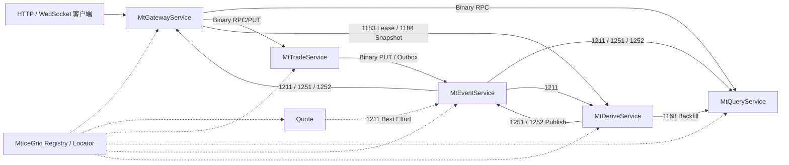

# TradingTerminal Ice 3.8.2 六服务改造方案

## 1. 改造目标

`mt5-terminal-v3` 将原单体终端拆分为六个独立 EXE：

- `MtGatewayService`
- `MtQuoteService`
- `MtTradeService`
- `MtQueryService`
- `MtEventService`
- `MtDeriveService`

六服务使用 Ice 3.8.2、CloudNetDataApi 和 MtIceGrid 组网。插件间统一使用 Binary RPC/PUT；JSON 只保留在 MtGatewayService 的 HTTP 和 WebSocket 边界。每个服务可独立启动、停止、重连和扩容，业务工程不接触 IceRPCPush 句柄、Slice 生成代码和连接维护实现。

## 2. 服务职责

| 服务 | Ice 对象 | 端口 | 核心职责 |
| --- | --- | ---: | --- |
| MtGatewayService | `MtGatewayServiceRPC` | 30001 | HTTP/WebSocket 入口、鉴权、参数校验、内部请求路由和前端推送转换 |
| MtQuoteService | `MtQuoteServiceRPC` | 30002 | MT 行情连接、symbols 代码链、Tick 接收和行情事件生产 |
| MtTradeService | `MtTradeServiceRPC` | 30003 | 下单/撤单/改单、订单/成交/持仓/保证金事件和配置事件 |
| MtQueryService | `MtQueryServiceRPC` | 30004 | 普通/历史 MT 查询、实时行情快照、K线，以及 WatchList/Chart PostgreSQL ClientData |
| MtEventService | `MtEventServiceRPC` | 30005 | Best Effort 行情转发和 Reliable 业务事件中心 |
| MtDeriveService | `MtDeriveServiceRPC` | 30006 | 收益、K线、派生缓存和基础状态恢复 |

原十二服务收敛关系：HTTP 与 WebSocket 合并为 MtGatewayService；交易事件、交易命令和配置服务合并为 MtTradeService；普通与历史查询合并为 MtQueryService；两个事件中心合并为 MtEventService 内部双引擎；收益与 K线合并为 MtDeriveService。只有出现独立扩容、故障域或资源争用证据时才重新拆分进程。

## 3. 调用拓扑



MtGatewayService 负责外部入口和接口分发，但不是内部事件总线。Quote、Trade 和 Derive 直接访问目标服务，避免所有流量绕经 MtGatewayService。

## 4. 网络分层

### 4.1 IceRPCPush

底层 DLL 负责 Ice 运行时、Binary Slice、同步/异步 RPC/PUT、Snappy、推送注册、异常转换、错误码和服务端有界队列。它不理解 MT 账户、品种、订单或 Web 协议。

### 4.2 CloudNetDataApi

业务网络 DLL 只暴露 C API，负责读取上层传入的 `<Service>.xml`、启动本地服务、维护远端连接表、定时重连、RegisterPush 续约、Publish 和 Binary 结果生命周期。六个服务只链接 `libCloudNetDataApi.lib`，不直接链接 IceRPCPush。

### 4.3 服务业务层

服务业务层实现固定宽度 Binary 契约和业务处理器。网络回调只做校验、深拷贝和入队，不允许在 Ice 回调线程执行 MT 阻塞调用、数据库大查询或 WebSocket 慢发送。

## 5. 内部协议

### 5.1 11xx 调用号

| 范围 | 目标 |
| --- | --- |
| `1100-1109` | 公共控制 |
| `1110-1119` | MtGatewayService |
| `1120-1129` | MtQuoteService |
| `1130-1149` | MtTradeService |
| `1150-1169` | MtQueryService |
| `1170-1179` | MtEventService |
| `1180-1189` | MtDeriveService |
| `1190-1199` | 诊断和压测 |

当前登记 `1101` 健康检查、`1102` 版本查询、`1122` 行情快照、`1132-1142` 交易接口、`1152-1166` 查询接口、`1172-1175` 可靠事件中心、`1182-1186` 派生接口和 `1191` Binary Echo。`1111/1121/1131/1151/1171/1181` Demo 均已废弃并删除活动实现。同步和异步共用同一功能号，业务代码只能引用 `EN_PLUGIN_FUNC_ID`。

### 5.2 12xx 通知号

`1201` 为服务状态；`1211` 为 Tick；`1221-1225` 为订单、成交、持仓、保证金和交易源状态；`1241-1243` 为品种、用户和分组配置；`1251-1252` 为收益和 K线；`1291` 为测试推送。

通知号只通过 `Publish.ReqNo` 传递。通知正文前使用 32 字节显式小端元数据，保存版本、来源、模式、动作、长度、Sequence 和时间戳。它不复用 Binary 调用的 `FuncId`，也不重复 Binary 请求已有的 `Version/SynId/RouteCode` 长包头。

### 5.3 Binary 契约

- 只使用固定宽度整数、UTF-8 字节和连续记录数组。
- 禁止传输指针、STL、`HANDLE`、平台 `bool` 和编译器结构体布局。
- 每种 Payload 独立定义 `ContractVersion`、头长度、记录长度和数量。
- 解码前校验版本、长度、乘法溢出、最大条数和保留字段。
- 交易命令在 Payload 中携带独立幂等键，不能把 `SynId` 当作幂等键。
- 载荷达到 1024 字节后尝试 Snappy，只有压缩结果更小时才使用。
- 单次原始载荷上限 50 MiB，大查询必须分页或业务分块。

唯一协议代码来源为 `common\protocol\TradingTerminalProtocol.h`，完整登记规则见 `docs\内部协议.md`。`1211` 当前只接受 108 字节固定头的 Quote Binary v1；MT4/MT5 由 `PlatformVersion=4/5` 表示，旧开发态 v3-v6 不迁移。

## 6. Web 协议隔离

MtGatewayService 保留前端功能号 `10001-10004`：心跳、订阅/推送、订阅状态和交易源重同步。内部 `1211`、`1221-1224`、`1241-1243`、`1251-1252` 映射为 Web `10002`；内部 `1225` 映射为 Web `10004`。

其他五个服务不得包含 Web 功能号。Web 功能号不能进入 Binary 调用，内部 `11xx/12xx` 也不能直接出现在浏览器报文。

## 7. 各服务连接和配置

### 7.1 MtGatewayService

- 主动连接 MtQueryService、MtTradeService、MtQuoteService、MtEventService 和 MtDeriveService。
- 对外登记 V2 的 28 个 HTTP URL，网关 Demo URL 已删除。
- 使用 V2 Token 算法校验 HTTP/Web 主体，禁止保存账户权限或业务状态。
- HTTP 请求按业务类型编码为 Query/Trade 原生 Binary 字段树，Payload 中不夹带 JSON。
- 幂等查询传输失败最多切换 READY 实例一次，交易和写操作禁止自动重试。
- 向 MtEventService 使用唯一网关实例 ID 注册行情、交易、配置和派生结果订阅。
- WebSocket 实现连接代次、`10001-10003`、八类 Topic（含 Kline=`128`）、快照增量屏障、固定 Sender 三类队列和慢连接关闭。
- Profit Topic 的全部会话需求按 `Version+No` 聚合，在后台扫描线程通过 `1183` 提交绝对 Login 集合并按租约续期；Web I/O 回调只标记需求变化。
- Profit 初始快照调用 `1184`，不再把 Query `1158` 账户结果当作实时收益；Derive 未就绪时向前端明确返回 `BOOTSTRAPPING`。
- 客户端重连后通过 HTTP 权威查询恢复状态，不把浏览器作为 Reliable 消费者。

### 7.2 MtQuoteService

- Event 反向连接 Quote 并注册 `|1211`；Quote 不主动连接 Derive、Query 或 Gateway。
- 同时支持 MT4、MT5 和同平台多 No，`Version+No` 是 SDK、序号和队列的隔离键。
- MT4 使用 `PumpingSwitchEx` 与 `SymbolInfoUpdated`；MT5 使用 Manager/Tick Sink、`SelectedAddAll` 和 SDK 自动重连。
- Manager 在每来源锁内生成非零 SourceEpoch 和连续序号；进程重启或原连接断线恢复时旋转 Epoch，消费者据此识别缺口。
- Tick 回调只做最小校验和深拷贝，进程内 FIFO 后台线程编码 Quote v1 和 ClientData `BYTES`，调用 `Publish(1211)`。
- `queueCapacity=0` 不因容量主动淘汰；正容量满时淘汰最旧 Tick。Quote 不提供 WAL、ACK、快照、时间偏移、M1、OpenPrice 或归档。
- 生产默认从进程环境变量读取 Manager 地址和凭据，不在 XML、日志和仓库保存真实密码。
- 第一阶段单实例运行，每个 `Version+No` 只允许一条 `QUOTE_PUMPING` 连接；Cluster 和同节点行情主备只作为第二阶段代码及注释示例保留。

### 7.3 MtTradeService

- 主动连接 MtEventService。
- `1131` Demo 已删除；`1132-1142` 通过 Trade Binary 文档进入 MT4/MT5 Adapter，支持同平台多个 `Version+No` 节点路由。
- ClientRequestId、请求摘要和首次结果持久化保存，相同请求重放首次结果，不同摘要复用同一键时拒绝执行。
- 交易成功项先写本地 durable outbox，再后台调用 MtEventService `1172`；Event 不可用时保留文件并在重启后继续补交。
- 每个活动节点持久化 SourceEpoch，并在同一 Epoch 内递增 SourceSequence。事件携带 EventId、节点、通知号、动作、序号和脱敏 Binary 正文。
- MT5 Dealer 命令被 SDK 接受时只返回 `submitted` 和 `RequestId`，不把受理伪装为已成交；最终状态由可靠事件或权威查询确认。
- 当前每个节点按 `TRADE_COMMAND/TRADE_PRECHECK/STATE_PUMPING/CONFIG_PUMPING/PUMPING_QUERY` 建立互不借用的独立角色池，`count` 创建真实 SDK Adapter，Pumping 连接由后台线程独占；真实柜台、完整预检规则和 MT5 最终成交状态机仍需联调。

### 7.4 MtQueryService

- 主动连接 MtQuoteService、MtEventService 和 MtDeriveService；最新报价使用 `1122+1211`，权威 M1 使用 `1185+1252` 两条独立冷启动链路。
- `1151` Demo 已删除。`1152` 按 `Version=0/4/5` 和 `No` 返回 V2 的 `ServerVersion/Mt4Managers/Mt5Managers` 结构；`1156` 读取最新行情内存快照；`1157` 先读历史文件和 coverage，只回源缺口，再合并 Derive 权威 M1。
- Query 原子保存实际 `1244` 切换日志，并将其优先用于账户、订单、持仓、成交和 K线历史时间转换；日志覆盖前才回退 Windows 动态规则。
- Query 不再从 Best Effort `1211` 生成 M1。`1252` 只接受 MtEventService 来源，并按 `SourceEpoch+LastSequence` 幂等更新。
- `1165/1166` 已迁移 V2 WatchList、Drawing、Drawing Sync、Indicator 和 Config Repository。Binary 字段树只在数据库边界转换为内存 JSONB 值，插件间不传 JSON 文本。
- PostgreSQL 运行时只读校验 `watchlist_item`、`chart_drawing`、`chart_indicator`、`chart_config_kv`，缺表或断库只让 ClientData 降级，不影响 `1101` 和行情查询。
- `1153-1155`、`1158-1164` 已进入正式 MT4/MT5 Adapter；普通查询池和历史大查询池按 `Version+No` 隔离并分别限流，连接耗尽立即返回 `MT_MANAGER_CONNECTION_BUSY`。
- `1157` 固定使用 `HISTORY_QUERY` 池，按目标日期 Windows 动态时区规则转换 UTC0 和服务器时间，支持文件损坏隔离、原子替换、重启恢复和本地分页；真实 MT 缺口、Broker 历史切换规则和 V2 尾部语义仍需差分。
- 空结果保持成功空数组；大历史结果使用分页，分页游标必须包含查询条件版本和数据源代次。

### 7.5 MtEventService

- 主动连接 MtQuoteService 和 MtDeriveService，分别订阅 `1211` 与 `1251/1252`。
- 当前 Best Effort 行情引擎完整校验 Quote 来源、`BEST_EFFORT+UPDATED`、ClientData 外层和 Quote v1 正文，按 `Version+No` 固定分片。
- 按 `SourceEpoch+Sequence` 拒绝重复和乱序，Epoch 变化记录流重建，Sequence 跳跃累计缺口；工作线程保持正文不变并以 Event 身份重新发布。
- `queueCapacity=0` 不因容量主动淘汰；正容量满时淘汰最旧 Tick。`1103/1176` 暴露接收、拒绝、水位、队列、淘汰、扇出和发布失败。
- `1251/1252` 只接受 MtDeriveService 来源；Event 严格解码 Derive Binary 后保持正文不变，以自身身份重新发布。
- Reliable 引擎使用 NATS JetStream，`1172` 按 EventId 幂等追加，`1173` 使用 durable pull consumer 拉取，`1174` 显式 ACK，`1175` 查询 Stream/Consumer 状态。
- 未 ACK 的 NATS 消息由 MtEventService 暂存进程内句柄；AckWait 到期或停机释放句柄后由 JetStream 重投。
- dev/test 均启用单节点 Reliable 引擎并固定 `replicas=1`；Cluster 和 Core NATS Broadcast 在第一阶段关闭，第二阶段才启用多 Event 广播。
- 两个引擎同进程但不共享队列、磁盘策略和过载规则。
- `RegisterPush/Publish` 只提供在线通知扇出，不能替代 JetStream durable consumer。

### 7.6 MtDeriveService

- `1181` Demo 已删除，正式处理 `1182-1186`。
- `1182` 按单个 `Version+No` 串行校验 SourceEpoch 和连续序号。Derive WAL、M1、双槽检查点和 WAL 截断完成后才返回 ACK；重复批次幂等成功，缺口批次拒绝推进。
- M1 按 `Version+No+Symbol` 隔离，用每一笔真实 Tick 更新 Open/High/Low/Close/Volume；无 Tick 分钟不制造假 K。
- `1185` 向 Query 返回稳定排序快照，M1 变化通过 `1252` 发往 MtEventService，再中继给 Query。
- `1183` 使用 Gateway 实例、启动代次、递增 Revision 和租约维护绝对 Login 集合，多个 Gateway 的需求取并集。
- `1184` 契约已经落地。Query/Trade 权威账户、持仓、品种、组和汇率状态完成前，服务明确返回 `DERIVE_STATE_BOOTSTRAPPING`，不发布 `1251`，不伪造零收益；启用真实 `1251` 前还必须为 MtGatewayService 增加专用的 Derive Profit Binary 到 Web Profit JSON 转换分支。
- `1186` 返回来源 Epoch/ACK/WAL、有效收益账号数和整体派生状态。
- ReliableConsumer 在 `dev` 可关闭、`test` 必须启用；`1173/1174 + 1167` 状态恢复、真实收益 worker 和本地 DLQ 已落地。独立 `MtDeriveDlqTool` 提供查看、导出、按 EventId 安全重放和审计，真实三节点重投与容量仍待 test 验收。

## 8. 配置和动态接入

每个进程使用独立 `<ProjectName>.xml`，构建后 XML 与 EXE 一起放在 `bin\x64vc14`。Locator 固定为：

```xml
<Property name="Ice.Default.Locator" value="MtIceGrid/Locator:default -h 127.0.0.1 -p 18000" />
```

CloudNetDataApi 根据 Local 启动服务，通过 Services 建立连接并每 5 秒重连，通过 Subscriptions 注册推送并每 240 秒续约。MtGatewayService 另外每 2 秒异步调用 `1101` 维护远端服务 `STARTING/READY/DOWN` 状态。服务晚启动或重启后，连接和业务状态会自动恢复；运行时新增未知服务需要先更新 XML 并调用 ReloadConfig。IceGrid 提供 Locator、应用部署和 Node 常驻托管，六个 Server 使用 `activation="always"`，异常退出后由 Node 重新激活。

本地单实例开发时，对象适配器可配置 `{Service}.AdapterId={Service}`，远端代理使用 `Identity@AdapterId`。生产 Query 双实例使用唯一 AdapterId 并加入 `ReplicatedMtQueryServiceRPC`，网关通过 `MtQueryServiceRPC@ReplicatedMtQueryServiceRPC` 建立两条独立客户端连接。只配置 Identity 会让 Locator 查找未登记对象，并返回 `Ice::NotRegisteredException`。

## 9. 启动顺序

1. 启动 IceGrid Registry。
2. 启动 IceGrid Node 和管理端检查。
3. 生产启用 Reliable 引擎时先启动 NATS JetStream，再启动 MtEventService、MtQueryService。
4. 启动 MtQuoteService、MtTradeService。
5. 启动 MtDeriveService。
6. 启动 MtGatewayService。

服务连接具备定时重连，因此顺序用于缩短初始化告警，不是永久依赖。进程重启后不要求整体重启。

## 10. 工程与验证

`project\vs2022\TradingTerminal.sln` 只包含六个 EXE。公共源码位于根 `common`，由六个项目共同引用；每个项目都有独立 include/source/conf 筛选器。Release 输出统一到 `bin\x64vc14`，六份项目名 XML 与 EXE 同目录，日志按 `log\<Service>` 隔离。独立 `MtGatewayServiceLoadTest` 工具不加入主解决方案。

验收包括：

- 六项目 `Release|x64` 在 `/W4 /WX` 下编译通过。
- MtGatewayService API 目录固定登记 28 个兼容 URL和两个健康接口，旧 `/api/v1/demo/*` 不存在。
- Query/Trade/ClientData Binary 协议往返、跨领域拒绝和截断包校验通过。
- Reliable Event domain、追加/拉取/ACK/状态请求及畸形报文协议测试通过。
- Quote Binary v1 的 MT4/MT5 往返、SourceEpoch、非法版本、非法 UTF-8、嵌入 NUL、截断和 ClientData `BYTES/OBJECT` 隔离校验通过。
- Derive `1182-1186` 协议、M1 OHLC、连续 ACK、重复/缺口批次、检查点恢复、WAL 重放和 Profit 租约边界通过。
- `1101` 同步健康检查和 `1191` 异步 Echo 成功。
- `1291` 可从 MtEventService 推送到已注册消费者。
- 非 MtGatewayService 源码不存在 Web 功能号。
- 协议数字不散落在业务代码，不存在活动 `DC_PROTOCOL_*`。
- 断线、后启动和重启后由连接维护线程恢复。
- 错误描述为详细英文，源码、配置和文档中文无乱码。

## 11. 当前边界

Quote/Event 第一阶段候选链路已经建立：`MtQuoteService -> 1211 -> MtEventService` 使用 Quote v1 在线中继，Event 再向 Derive、Query 和 Gateway 扇出。Quote 不再提供 WAL、`1122/1123/1182`、TIME_QUERY 或派生业务；Derive、Query 和 Gateway 的旧快照、时间及 `1182` 消费路径仍需后续迁移，因此当前只可编译、可单测，不得宣称端到端生产平替。

MtTradeService 已落地 `1132-1142`、MT4/MT5 SDK Adapter、多节点路由、64 分片持久化幂等、SourceEpoch/SourceSequence、durable outbox、MT4 Pumping、MT5 Dealer RequestId 状态跟踪和重启对账；MtEventService 已落地 JetStream `1172-1175` 可靠事件接口。MtDeriveService 已落地 `1182-1186`、无损 M1、检查点恢复、收益租约、权威状态快照增量恢复、真实收益 worker、`1251` 发布及 DLQ 运维闭环；真实权威输入未恢复完整时 `1184` 仍按来源返回 `BOOTSTRAPPING`。尚未完成真实 MT 柜台差分、全部平台预检规则、三节点 JetStream/DLQ 容量与恢复验收。`1211` 仍是 Best Effort，不提供历史补发。

## 12. MtEventService 横向扩展实施补充（2026-08-01）

- Event 按双活部署，每实例使用唯一 AdapterId 和推送 pluginId；进程内订阅表只管理连接到本实例的 Ice 客户端。
- 新增 NATS 广播总线：本实例收到的行情、交易、配置和派生通知发布到集群 Subject，其他 Event 实例消费后只向本实例客户端扇出，并用来源实例 ID 防止回环。
- Reliable `MT_TRADING_EVENTS` 与 Best Effort 广播继续使用独立处理链路；广播拥塞不能阻塞 durable fetch/ACK。
- 双 Event 实机重复通知、网络分区、积压和 10 万连接扇出仍属于外部验收项。
